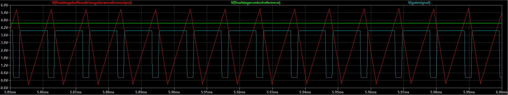
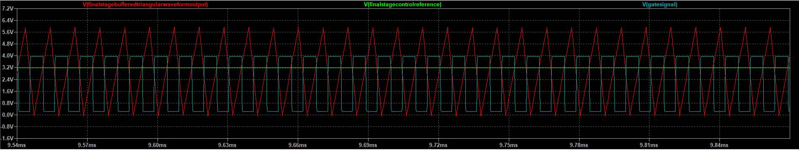
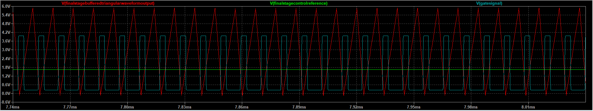

# 🪫 Analog Lead-Acid Battery Charger Simulation (LTspice)

This project presents a fully **analog-based lead-acid battery charging system**, simulated in **LTspice**. It demonstrates core concepts in analog circuit design, waveform generation, comparator logic, and power switching — all built using discrete and op-amp components without microcontrollers or digital control.

The simulation highlights the **charging profile control** of a lead-acid battery using a three-stage algorithm: **Bulk**, **Absorption**, and **Float**. These stages are detected and managed purely through analog circuitry primarily due to the difficulty in simulating microcontrollers and electronics together in freely available simulation software. 

The purpose of this project is to build a battery charger that takes in solar panel input to charge a lead acid battery. The idea is then to use the charged battery in an inverter system ([Single Phase Inverter](https://github.com/Yasteer/Single-Phase-Inverter)) that can produce single phase electricity. Combining these two repositories will hopefully be the start of a cheap off-grid solar powered system.

---

## 🎛️ Design Philosophy: Analog First

> Several subsystems in this project could have been implemented using a digital microprocessor. However, the choice to pursue a purely analog design was deliberate.
> This decision was driven by the constraints of using free simulation software. Most free tools tend to specialize in either microcontroller simulation or analog circuit simulation—but rarely both.
> Rather than invest in a paid solution like Proteus, the project remains focused on analog electronics to stay within a single, well-supported simulation domain.
> Analog design is currently the most practical and efficient path for development and testing in this context, making it the preferred approach.

### 🔺➖➕ Operational Amplifier Selection
> Slew Rate is the major limiting factor of operational-amplifier selection for this use-case.
> The LM741 is a general purpose op-amp with a slew rate of 0.5V/us. This is not great for square waveforms of high frequencies and the op amp creates distorted output.
> The LT1364 is an over the top op-amp, with a slew rate of 1000V/us. This is much better for our purposes of high frequency signal handling. 
> For standardization purposes, all op-amps in this project are chosen to be of the LT1364 type. 

---

## 🧩 Project Structure

The design is divided into the following functional subsystems:

### 1. 🔋 Battery Charge Stage Identification
**Purpose**: Determine which charging stage the battery is currently in based on its voltage.

**Design Selections**: 
- A lead-acid battery was selected due to it's cheaper cost as well as it's simpler charge profile as opposed to that of its lithium based counterpart.

**Circuits Used**:
- **Dual Window Comparator** (built with LT1011)
- **Summing Amplifier** (used for voltage level manipulation and reference scaling)

This subsystem classifies the battery into one of three states:
- **Bulk** (Low voltage, high current)
- **Absorption** (Medium voltage, tapering current)
- **Float** (Maintaining full charge)

---

### 2. 📐 100kHz Triangular Waveform Generator
**Purpose**: Provide a continuous triangular waveform at 100kHz to be used for PWM comparison.  
**Circuits Used**:
- **555 Timer** in astable mode (generates square wave clock)
- **Integrator Op-Amp** (converts square to triangle)
- **Summing Amplifier** (adjusts amplitude/offset as needed)

**555-Timer Calculations**:

555 Timer Output Frequency = 1.44/{ (R1 + 2R2) C }
> Select output frequency to match mosfet maximum switching frequency of 100kHz or a period of 10us.

> Choose C = 1nF & R1 = 5k
>
> Solve for R2, Result = 4.7k
>
> Result = 0 - 5V Unipolar Square Wave Output.
>
> AC-Coupling Capacitor Added To Modify The Signal Into A -2.5V - +2.5V Bipolar Equivalent. 

**Integrator Calculations**

> Vout = -(Vin*t)/(R*C)

> Vin = 5V Square Wave From 555-Timer
> 
> t = Half(Square Wave Period) = 5us
>
> Vout = 2.5V
>
> Choose R = 10k, Solve for C = 1nF

**Summing Amplifier**
- Used to convert bipolar -2.5V - + 2.5V Triangular signal into a unipolar 0 - 5V Triangular signal.
- Accomplished by adding a DC offset as neccessary.
---

### 3. 🧠 PWM Generator (Analog Modulator)
**Purpose**: Create a PWM signal whose **duty cycle reflects the battery charging stage**, while maintaining a **fixed frequency of 100kHz**.  
**Circuits Used**:
- **LT1011 Comparator**: Compares the triangular wave (from subsystem 2) against the voltage levels generated in subsystem 1 to generate PWM.

---

### 4. ⚡ Gate Driver & MOSFET Switch
**Purpose**: Drive an **IRLZ44N N-channel MOSFET** at 100kHz to control current into the battery based on PWM duty cycle.  
**Circuits Used**:
- LT1364-buffered PWM signal
- Gate driver network
- IRLZ44N power switch

---

### 5. 🔋 Battery Model
- Battery modelled by a capacitor in series with a resistor
- Charge Time Constant (τ) = (R)(C); Where τ = 1s chosen for simulation
- Full charge achieved at 5τ or 5s in an ideal world

**Model Analysis**
- For a simple model, it gets the job done of acting as a device that stores charge
- The main issue is that it does not model a realistic battery charge/discharge curve which has regions of constant current and constant voltage
- The current model reacts immediately to changes in charge

**Model Improvements**
- Build a behavioral *SPICE* model that generates a voltage as a function of the State-Of-Charge (SOC) of the battery
---

## 📊 Simulation Results
The following PWM captures display the circuits ability to automatically adapt the gate charging signal to the battery charging system.
Note that at lower battery voltages, the system produces a larger PWM duty cycle and at higher voltages, it scales down the duty cycle.

* Bulk Mode PWM
> 

* Absorption Mode PWM
> 

* Float Mode PWM
> 
---

## 🧠 Design Notes

- All active buffering is handled by the **LT1364 dual op-amp**, chosen specifically for its high slew rate and bandwidth — critical for 100kHz operation.
- The **LM741** was intentionally avoided due to its insufficient performance at high frequencies.
- The entire system operates without any digital logic or microcontroller — a pure analog control strategy.

---

## 🛠️ Tools Used

- **LTspice XVII**
- Discrete analog components
- Industry-standard op-amps and comparators

---

## 📁 Repository Contents

- `/schematics/`: Contains `.asc` LTspice schematic files for each subsystem
- `/plots/`: Simulation waveforms showcasing each subsystem in operation
- `README.md`: This documentation
- Additional notes on design rationale, tuning, and improvements

---

## 📌 Future Enhancements

- Modify the 555-Timer to have a 50% duty cycle for the square waveform output to produce a symmetrical triangular waveform output at the integrator circuit. This will reduce the DC-Offset error.
- Integrate temperature compensation for float voltage
- Add current-sensing feedback loop for constant-current regulation
- PCB design and hardware prototype

---

## 👤 Author

**Yasteer Sewpersad**  
Electrical, Control & Instrumentation Engineer  
South Africa 🇿🇦

---

## 📜 License

This project is open-source under the MIT License. See `LICENSE` for details.
